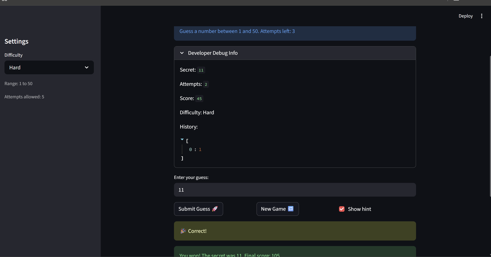

# 🎮 Game Glitch Investigator: The Impossible Guesser

## 🚨 The Situation

You asked an AI to build a simple "Number Guessing Game" using Streamlit.
It wrote the code, ran away, and now the game is unplayable. 

- You can't win.
- The hints lie to you.
- The secret number seems to have commitment issues.

## 🛠️ Setup

1. Install dependencies: `pip install -r requirements.txt`
2. Run the broken app: `python -m streamlit run app.py`

## 🕵️‍♂️ Your Mission

1. **Play the game.** Open the "Developer Debug Info" tab in the app to see the secret number. Try to win.
2. **Find the State Bug.** Why does the secret number change every time you click "Submit"? Ask ChatGPT: *"How do I keep a variable from resetting in Streamlit when I click a button?"*
3. **Fix the Logic.** The hints ("Higher/Lower") are wrong. Fix them.
4. **Refactor & Test.** - Move the logic into `logic_utils.py`.
   - Run `pytest` in your terminal.
   - Keep fixing until all tests pass!

## 📝 Document Your Experience

- [X] Describe the game's purpose.
1.The games purpose is to randomly generate a number in a specificed field depending on the difficulty selected. Afterwards the player will have a set amount of guesses to find the secret number other wise they will have to try again in a new game. 
- [X] Detail which bugs you found.
1.The hint was guiding me in the wrong direction from the secret. 
2.The new game button was not letting me immediately start a new game without refreshing the page. 
3.The amount of attemps was having a case of off by 1 error because it would say 6 attempts and onlt give the user 5. 

- [ ] Explain what fixes you applied.
1.I fixed the hints to give the user the right information and guide them the correct way to the secret. 
2.The new game button now actually sets the variables to the statuses that a new game should be at. 
3.Fixed the number of attempts being saved in the initial session state from 1 to 0 so the user has the correct amount of attempts presented in the display.
4.Fixed the displaying of the range under make a guess to display the ranges depending on the difficulty selected. 

## 📸 Demo

- [X] [Insert a screenshot of your fixed, winning game here]

## 🚀 Stretch Features

- [ ] [If you choose to complete Challenge 4, insert a screenshot of your Enhanced Game UI here]
